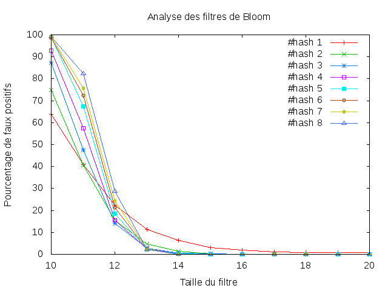

=========
Réponses
=========

---------------------------
4.2. Le module bloomfilter
---------------------------
3) Si la taille du filtre est de 1 ou 2, alors un mot tiré au hasard apparaît toujours présent.

---------------------------------
4.3. L'analyse des faux-positifs
---------------------------------
3)

4) On note que par rapport à la plus petite taille de filtre, le pourcentage de faux positifs dépasse les 60% et se rapproche des 100% lorsque le nombre de fonctions de hachages augmente. On remarque aussi que plus la taille du filtre augmente, plus le pourcentage de faux positifs tend vers 0.
