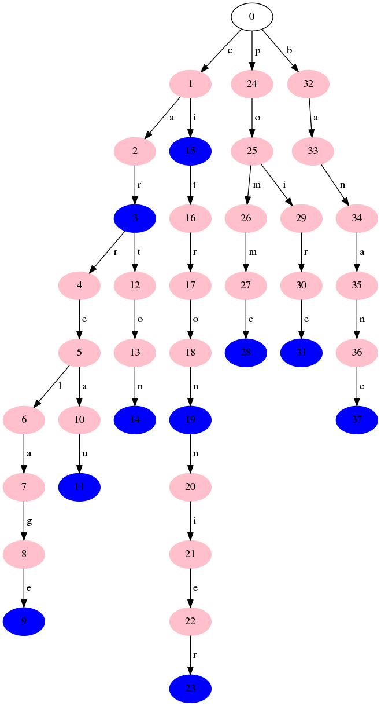
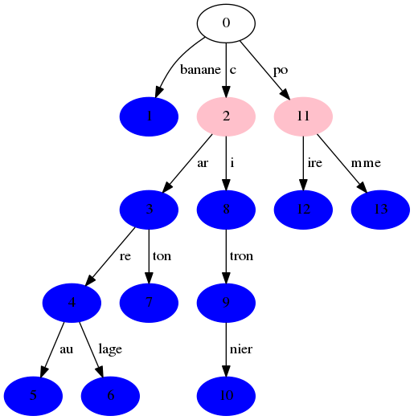

=========
Réponses
=========

---------------------------
6.1 Construction d'un trie
---------------------------

1) Un dictionnaire contenant différentes clés: une clé pour savoir si c'est un mot, les fils (= les lettres) contenant lui-même un dictionnaire de ce type jusqu'à arriver au bout des mots (branches).

2) {'p': {'o': {'i': {'r': {'e': {'mot': True}, 'mot': False}, 'mot': False}, 'mot': False, 'm': {'mot': False, 'm': {'e': {'mot': True}, 'mot': False}}}, 'mot': False}, 'c': {'i': {'mot': False, 't': {'r': {'o': {'n': {'n': {'i': {'e': {'r': {'mot': True}, 'mot': False}, 'mot': False}, 'mot': False}, 'mot': True}, 'mot': False}, 'mot': False}, 'mot': False}}, 'mot': False}, 'b': {'a': {'n': {'a': {'n': {'e': {'mot': True}, 'mot': False}, 'mot': False}, 'mot': False}, 'mot': False}, 'mot': False}, 'mot': False}

3) Un trie vide est un dictionnaire contenant seulement la clé "mot" avec le booléen False car il ne comporte aucun mot.

---------------------------
6.3 Affichage d'un trie
---------------------------

2)

--------------------------------
6.4 Version compactée d'un trie
--------------------------------

4) 

