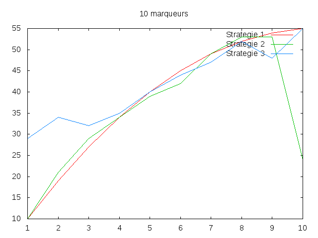
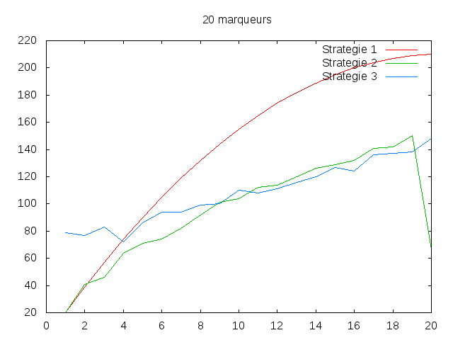
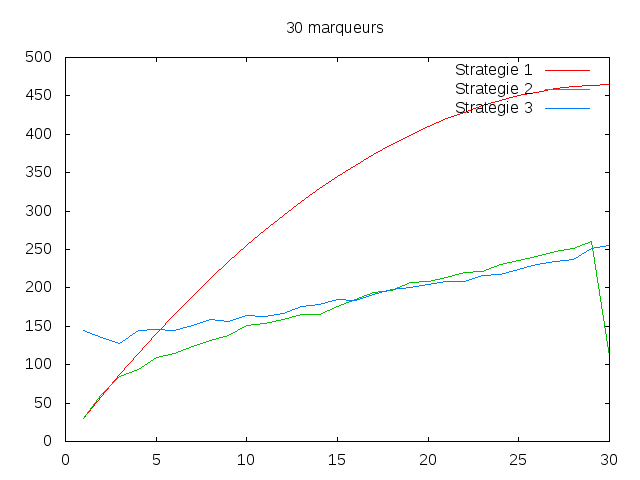
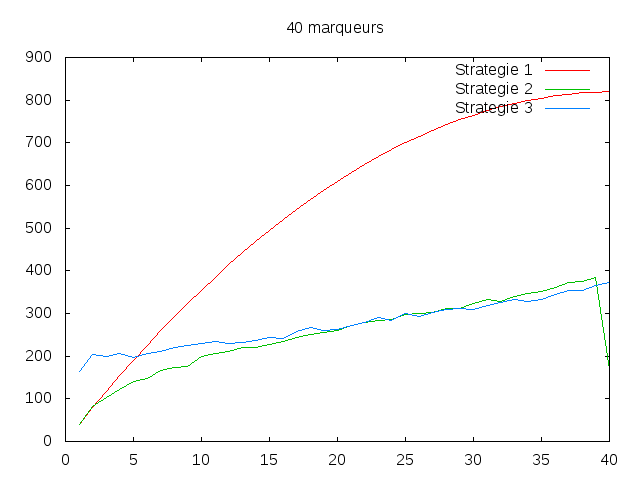
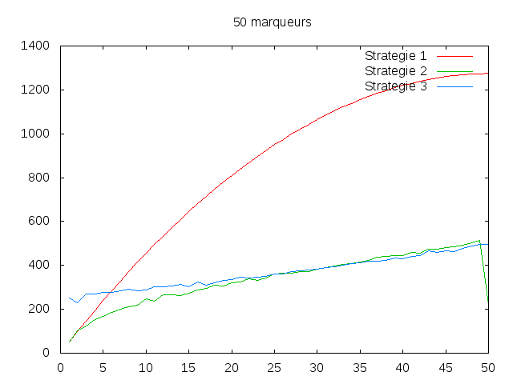
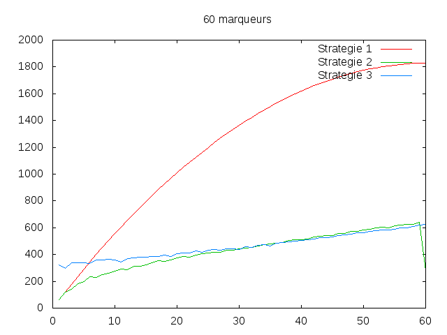
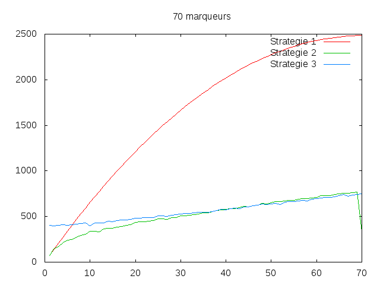
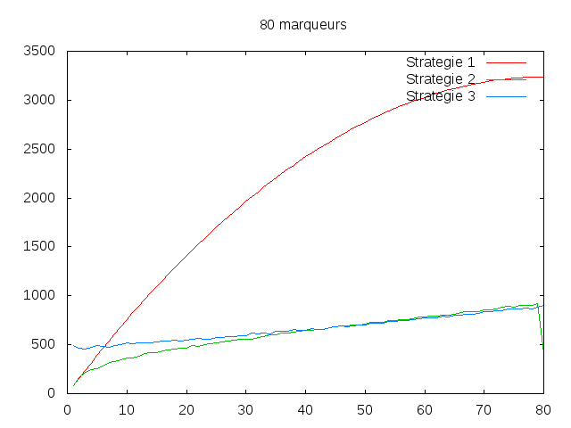
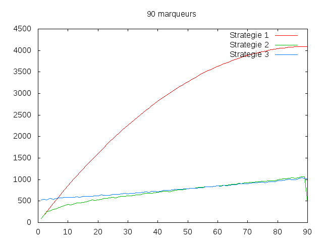
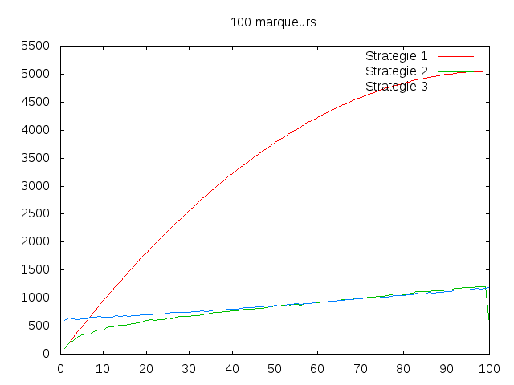

=========
Réponses
=========

-----------------
1.2. Stratégie 1
-----------------

2) Nous proposons de compter le nombre de comparaisons qu'il y a entre les marqueurs et les marqueurs positifs, c'est-à-dire le nombre de fois où la comparaison "compare(i,positive[j])==0" s'effectue.

3) Il n'y a pas de pire de cas pour cet algorithme car tous les marqueurs positifs sont inclus dans la liste des marqueurs.

4) 

.. math:: c1(m,p) = {\sum_{i=1}^{m}nbcomp(mark[i-1],positive)} = {\sum_{k=1}^{p}nbcomp(mark[k-1],positive)} + {\sum_{j=1}^{nbnegative}nbcomp(mark[j-1],positive)} = {\sum_{k=1}^{p}k} + {\sum_{j=1}^{m-p}nbcomp(mark[j-1],positive)} = {\sum_{i=1}^{p}k} + {(m-p)*p} = {\frac{p(p+1)}{2}} + {(m-p)*p}

-----------------
1.3. Stratégie 2
-----------------

2) Le pire des cas est quand la recherche dichotomique est la pire à chaque fois et que le tri fusion est le pire des cas (pour la liste des marqueurs positifs).

.. math:: c2(m,p)= m(1+\lfloor log2(p)\rfloor) + O(p*\lfloor log2(p)\rfloor)

-----------------
1.4. Stratégie 3
-----------------

2) Le pire des cas est quand les marqueurs positifs (qui sont triés) sont situés à la fin de la liste triée des marqueurs et que le tri fusion est le pire des cas (pour la liste des marqueurs positifs et pour la liste des marqueurs).

.. math:: c3(m,p)= m + O(m*\lfloor log2(m)\rfloor) + O(p*\lfloor log2(p)\rfloor)

----------------------------------------------
1.5 Recherche empirique des cas favorables
----------------------------------------------

2) Stratégie 1 est meilleure pour m=10 et p=3

   Stratégie 2 est meilleure pour m=20 et p=6

   Stratégie 3 est meilleure pour m=30 et p=25

6)

Pour 10 marqueurs les stratégies sont à peu près équivalentes en nombres de comparaisons. Mais lorsque le nombre de marqueurs augmente, une différence apparait entre les stratégies 1 et un regroupement des stratégies 2,3. Les stratégies 2 et 3 s'avèrent bien meilleure en terme d'efficacité que la stratégie 1. Néanmoins on peut observer une légère différence entre les stratégies 2 et 3, quand le nombre de marqueurs positifs est inférieur à la moitié du nombre de marqueurs totals, la stratégie 2 est meilleure que la stratégie 3.	

